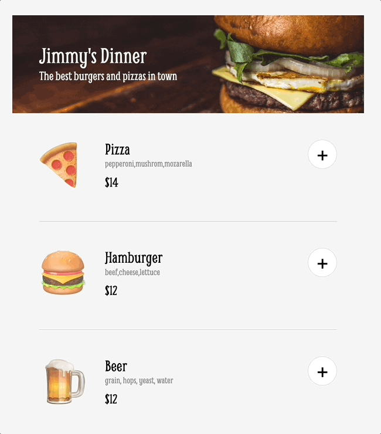

# Mobile Ordering App
a simple  four-stage restaurant app featuring three items 
- default menu state (view menu, add or delete order
- pre-check-out state (view sub-total, total)
- payment-modal state (adds credit card information)
- order-complete state (confirmation thank you message)

[Try it here](https://gilded-hamster-419458.netlify.app/)

## Intro
A training project built to consolidate key concepts I learned from:

**Module 5 - Essential JavaScript Concepts** [Scrimba Frontend Career Path Course 🚀](https://scrimba.com/learn/frontend) 

## Lesson
- separating concerns 
- attaching data attributes to identify target elements
- dynamically generate and render html using data stored in JavaScript

## Demo
 

